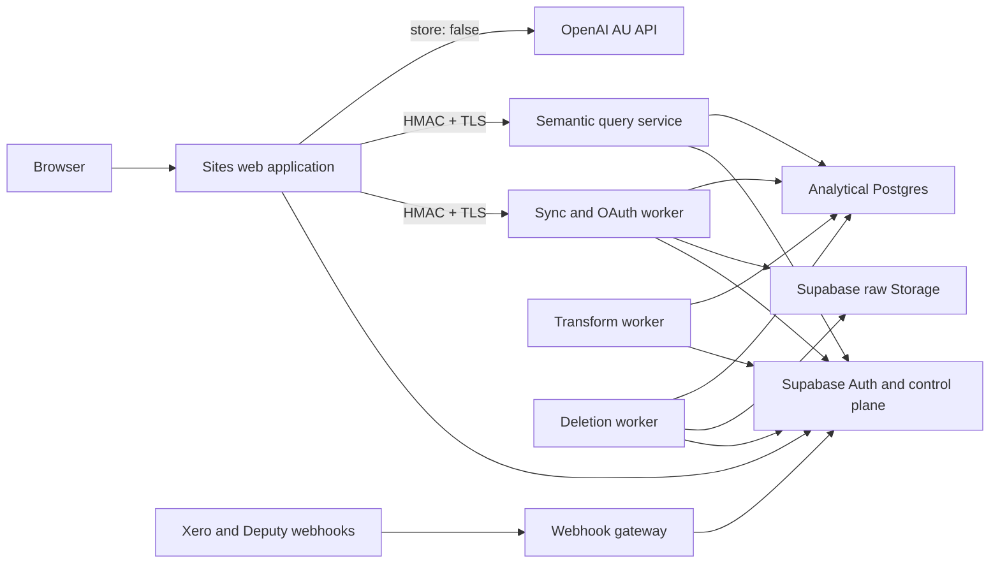

# Albert

Albert is a production-oriented natural-language analytics platform for Lightspeed Retail R-Series, Xero, and Deputy. A signed-in organisation connects its own systems, Albert ingests and reconciles the source data, and the OpenAI Agents SDK streams an ordered analytical trace: progress, governed tables, charts, validation, provenance, and the final evidence-bound answer.

Production does not contain a demo-data fallback. If Auth, a connector, a queue, the semantic service, or OpenAI is unavailable, the application reports a recoverable unavailable state instead of presenting fixture results as real data.

## Architecture



The trust boundaries, release ordering, and rationale are recorded in [ADR 0006](docs/adr/0006-sydney-cell-topology-and-protected-release.md). The complete product contract is [the V1 specification](docs/albert-v1-spec.md).

## Implemented production surfaces

- Supabase email/password authentication, callback, recovery, membership-scoped tenant bootstrap, and row-level security.
- Real OAuth start/callback/account-selection/disconnect flows with worker-only vendor secrets and envelope-encrypted refresh tokens.
- Lightspeed R-Series, Xero, and Deputy connector packs with cursoring, pagination, retries, rate budgets, webhook verification, immutable raw landing, typed staging, quarantine, and canonical mapping.
- Durable pgmq sync orchestration, isolated transform and deletion workers, leases, heartbeats, idempotency, reconciliation, quality checks, and cross-store purge proofs.
- A reviewed semantic registry, source-field catalogue, tenant allowlists, role/PII gates, hybrid retrieval, compiled parameterized SQL, provenance, validation, and bounded query execution.
- OpenAI Agents SDK conversations using current Albert-supported model profiles, user-selectable reasoning effort and Fast mode, local conversation state, `store: false`, and ordered auditable SSE events.
- Light, dark, and system themes based on the `/app/dash` design system, including reduced-motion behavior and recoverable connection states.
- Hardened service images, Sydney Fly manifests, protected release workflow, immutable migration ledger, environment validation, and readiness checks.

## Local verification

Node.js 22.23.1 or later and PostgreSQL 17 are required. Copy `.env.example` into your local secret manager or an ignored `.env.local`; never commit populated values.

```bash
npm ci
npm run registry:check
npm run test:deployment
npm run check
npm run dev
```

The default production conversation runtime is live. Fixture traces require both `ALBERT_CONVERSATION_RUNTIME=fixture` and `ALBERT_ALLOW_FIXTURE_RUNTIME=true`, and are rejected when `NODE_ENV=production`.

Database integration checks are reproducible in CI. For a new local database, an administrator first creates the group roles and then the migration runner applies each immutable stream:

```bash
npm run migrate -- --target=control-plane --bootstrap
npm run migrate -- --target=analytical --bootstrap
```

Do not use `--bootstrap` for ordinary releases.

## Production deployment

Follow [the production runbook](deploy/README.md). It covers the Sydney Supabase and analytical cells, vendor registrations, process-specific secrets, first bootstrap, Fly applications, Sites deployment, semantic publication, monitoring, rollback, key rotation, and the human acceptance test.

Routine releases are manually promoted through a protected GitHub `staging` or `production` environment using [`.github/workflows/release.yml`](.github/workflows/release.yml). The workflow runs the full check, migrates both cells, publishes the exact semantic snapshot, validates and deploys all five services, enforces private-worker networking, and waits for readiness. The Sites web release follows only after that cell is healthy.

## Repository map

- `app/` — authenticated web application, API routes, and Dash UI
- `connectors/` — Lightspeed R-Series, Xero, and Deputy packs
- `packages/` — canonical schema, compiler, queue, storage, security, semantic registry, and usage metering
- `services/` — conversation, control-plane, sync/OAuth, transform, webhook, semantic-query, and deletion runtimes
- `infra/` — database role bootstrap and immutable migrations
- `deploy/` — Fly manifests and production operations
- `evals/` and `tests/` — grounding, security, connector, SQL isolation, runtime, deployment, and UI contracts
- `docs/adr/` — architecture decision records

## Security invariants

- Browser code receives only the Supabase URL and publishable key.
- Vendor client secrets, refresh tokens, token-encryption keys, analytical credentials, and raw-storage keys never enter the browser or model context.
- The Supabase `service_role` key is not a service deployment credential.
- The model receives bounded user/final narrative context and governed tool results, never refresh tokens, raw payloads, arbitrary SQL, hidden reasoning, or unrestricted control-plane rows.
- Every analytical result carries tenant scope, semantic version, source lineage, time range, validation, and an answer state. Unsupported figures are withheld before delivery.
- Every user or connection deletion is fenced against new writes, remotely revoked where supported, purged across all stores, verified, and completed with a content-addressed proof.

Report a suspected security issue privately to the repository owner; do not include credentials or customer data in a public issue.
